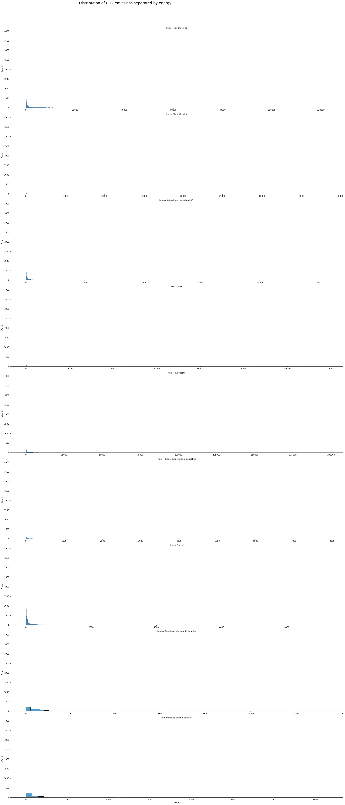
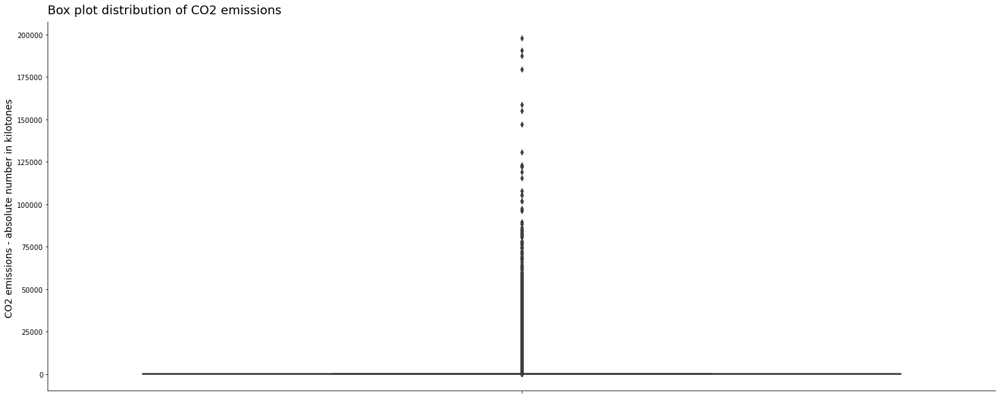
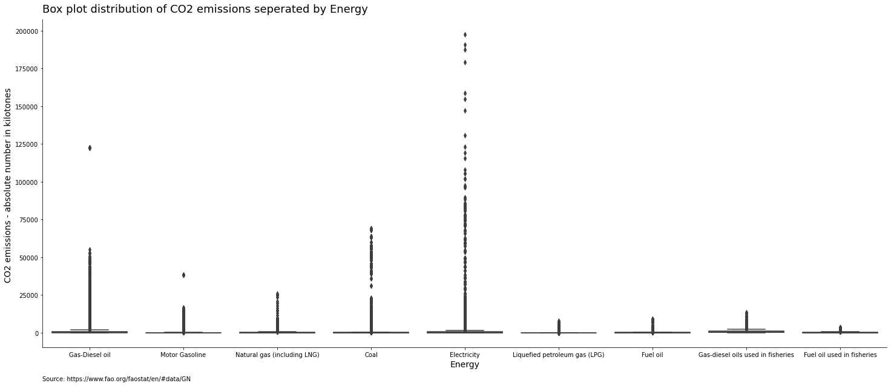
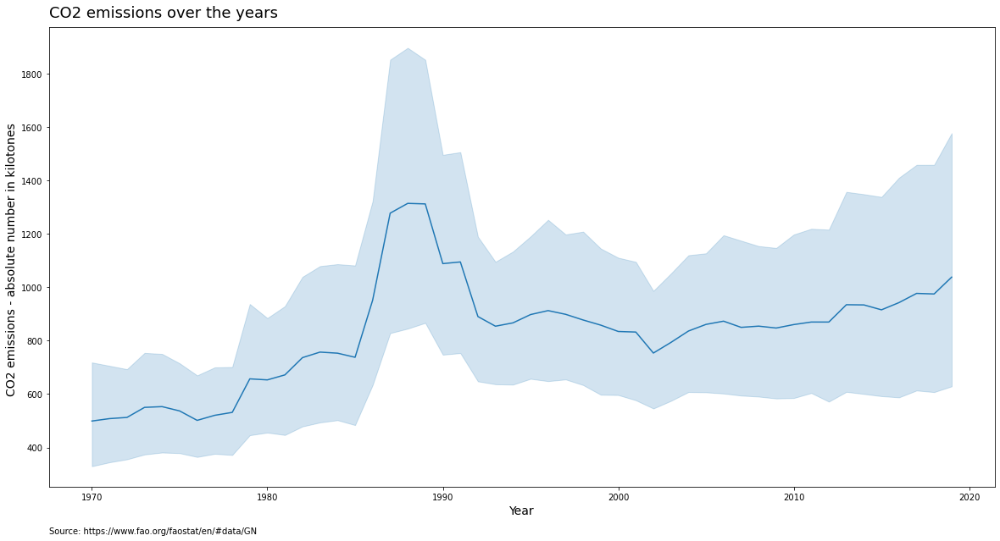
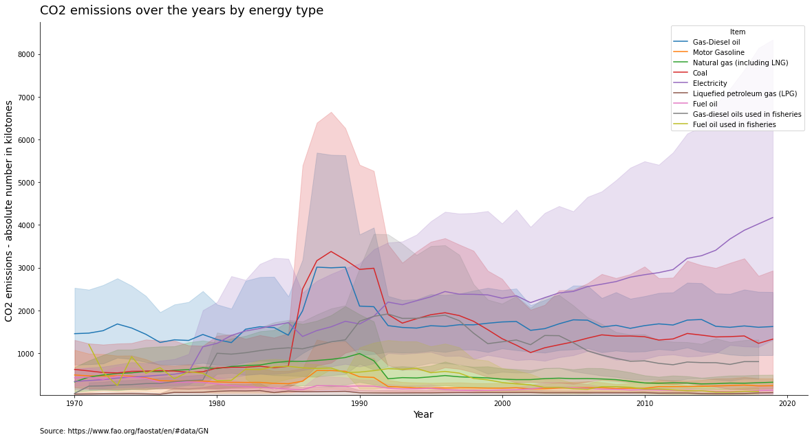
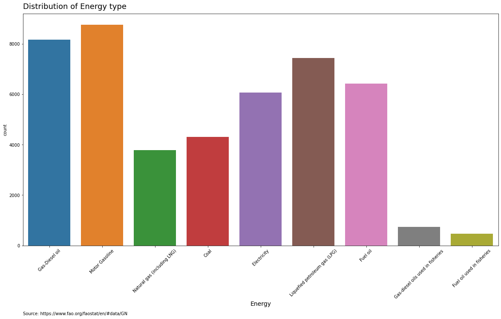

# Team Enterpernures
> **Submitted by:** **Muhammad Waleed Anjum** & **Ahsan Shakoor**

## Exploratory Data Analysis (CO2 Emissions from Different Energy Sectors) 
Data Source: [Food and Agriculture Organisation of the UN](https://www.fao.org/faostat/en/#data/GN)

## Introduction
In recent years climate change has gained significant momentum. The one key sources of CO2 emissions has been from energy usage. In this project the CO2 emissions form specific energy sectors will be investigated. 

## About the Dataset:
- Provided by the [Food and Agriculture Organisation of the UN](https://www.fao.org/faostat/en/#data/GN), the dataset used in this EDA has records covering approx. 50 years from 1970 to 2019.  It holds a breakdown of CO2 emissions for a number of energy sectors from a myriad of countries. As it will become apparent, CO2 emissions from energy industries fluctuates over time and country to country. It is also notable that the energy types used in the fishing sector are particularly polluting. Moreover, the energy reliance differ from nation to nation and therefore the CO2 emissions from such sectors also vary. 

## Methodolgy:
- First of all whole data was explored. Redundent Data was removed to simplify the analysis. There were no missing values however distribution of data is not evenly distributed due to multiple reasons i.e energy usage fluctuations in differents seasons and different parts of the globe, similarly there is huge difference in energy usage of different sectors.
- We Divide our EDA into two parts.
  - Part 1 is EDA on whole data
  - Part 2 is EDA on Subcontinent Countries only
## Part-1: EDA on Whole DataSet

### Step-1: Importing Libraries

```python
# importing libraries
import pandas as pd
import numpy as np
import matplotlib.pyplot as plt
import seaborn as sns
```

### Step-2: Importing Dataset

```python
df = pd.read_csv('energy_use_data_11-29-2021.csv')
df.head().T
```
> **Output :**

|                  | 0               | 1               | 2               | 3               | 4               |
|------------------|-----------------|-----------------|-----------------|-----------------|-----------------|
| Domain Code      | GN              | GN              | GN              | GN              | GN              |
| Domain           | Energy Use      | Energy Use      | Energy Use      | Energy Use      | Energy Use      |
| Area Code (ISO3) | AFG             | AFG             | AFG             | AFG             | AFG             |
| Area             | Afghanistan     | Afghanistan     | Afghanistan     | Afghanistan     | Afghanistan     |
| Element Code     | 7273            | 7273            | 7273            | 7273            | 7273            |
| Element          | Emissions (CO2) | Emissions (CO2) | Emissions (CO2) | Emissions (CO2) | Emissions (CO2) |
| Item Code        | 6801            | 6801            | 6801            | 6801            | 6801            |
| Item             | Gas-Diesel oil  | Gas-Diesel oil  | Gas-Diesel oil  | Gas-Diesel oil  | Gas-Diesel oil  |
| Year Code        | 1990            | 1991            | 1992            | 1993            | 1994            |
| Year             | 1990            | 1991            | 1992            | 1993            | 1994            |
| Unit             | kilotonnes      | kilotonnes      | kilotonnes      | kilotonnes      | kilotonnes      |
| Value            | 231.4918        | 188.5317        | 47.9904         | 38.6116         | 31.4465         |
| Flag             | F               | F               | F               | F               | F               |
| Flag Description | FAO estimate    | FAO estimate    | FAO estimate    | FAO estimate    | FAO estimate    |


### Step-3: Data Shape
> Shape function tells us number of Observations and columns.
> In this dataset we have 14 columns and 46131 records or obervations
```python
# Shape of Dataset
row, col=df.shape
print('Total number of observations/rows/entries:', row)
print('Total number of columns:', col)
```
> **Output :**

```python
Total number of observations/rows/entries: 46131
Total number of columns: 14
```

### Step-4: Data Structure
> Extracting Basic Dataset Information: 
> - Our dataset contain 
>     - RangeIndex: 0 - to - 46131 
>     - Total Columns: 14 
>     - No of  Non-Null Values: Zero
>     - Dtypes: float64(1), int64(4), object(9) 
>     - memory usage: 4.9+ MB
```python
df.info()
```
> **Output :**

```python
<class 'pandas.core.frame.DataFrame'>
RangeIndex: 46131 entries, 0 to 46130
Data columns (total 14 columns):
 #   Column            Non-Null Count  Dtype  
---  ------            --------------  -----  
 0   Domain Code       46131 non-null  object 
 1   Domain            46131 non-null  object 
 2   Area Code (ISO3)  46131 non-null  object 
 3   Area              46131 non-null  object 
 4   Element Code      46131 non-null  int64  
 5   Element           46131 non-null  object 
 6   Item Code         46131 non-null  int64  
 7   Item              46131 non-null  object 
 8   Year Code         46131 non-null  int64  
 9   Year              46131 non-null  int64  
 10  Unit              46131 non-null  object 
 11  Value             46131 non-null  float64
 12  Flag              46131 non-null  object 
 13  Flag Description  46131 non-null  object 
dtypes: float64(1), int64(4), object(9)
memory usage: 4.9+ MB
```

### Step-5: Finding Missing Values
> DataSet is cleaned as far as missing values are concerned
```python
df.isnull().sum()
```
> **Output :**
```python
Domain Code         0
Domain              0
Area Code (ISO3)    0
Area                0
Element Code        0
Element             0
Item Code           0
Item                0
Year Code           0
Year                0
Unit                0
Value               0
Flag                0
Flag Description    0
dtype: int64
```
### Step-6: Summary Statistics

```python
df.describe()
```
> **Output :**

|       | Year        |  Value      |
|-------|-------------|-------------|
| count | 46131       | 46131       |
| mean  | 1998.988814 | 863.132722  |
| std   | 13.111035   | 5274.730687 |
| min   | 1970        | 0           |
| 25%   | 1990        | 3.37075     |
| 50%   | 2000        | 21.4899     |
| 75%   | 2010        | 165.7289    |
| max   | 2019        | 197674.5593 |


### Step-7: Value Counts

```python
df.Item.value_counts()
```
> **Output :**

```python
Motor Gasoline                       8756
Gas-Diesel oil                       8160
Liquefied petroleum gas (LPG)        7431
Fuel oil                             6418
Electricity                          6061
Coal                                 4304
Natural gas (including LNG)          3787
Gas-diesel oils used in fisheries     747
Fuel oil used in fisheries            467
Name: Item, dtype: int64

```python
# unique values in each column
df.nunique
> **Output :**

```python
Domain Code             1
Domain                  1
Area Code (ISO3)      229
Area                  229
Element Code            1
Element                 1
Item Code               9
Item                    9
Year Code              50
Year                   50
Unit                    1
Value               34024
Flag                    3
Flag Description        3
dtype: int64
```
### Step-8: Feature Selection
> "Domain Code", "Domain", "Element Code" and "Element" contain only one variable. Similarly "YearCode", "Area Code" and "Flag" columns does not provide any useful insights. Therefore these can be removed from the dataset with no loss of understanding/ distorting the overall dataset.
```python
# Clean data - exclude unnecessary data improved readability

df_clean = pd.read_csv("energy_use_data_11-29-2021.csv")
x = ["Area Code (ISO3)", "Domain Code", "Domain", "Element Code", "Element", "Year Code","Flag" ]
df_clean.drop( x, inplace = True, axis =1)
df_clean.head()
```
> **Output :**

```python
Area	Item Code	Item	Year	Unit	Value	Flag Description
0	Afghanistan	6801	Gas-Diesel oil	1990	kilotonnes	231.4918	FAO estimate
1	Afghanistan	6801	Gas-Diesel oil	1991	kilotonnes	188.5317	FAO estimate
2	Afghanistan	6801	Gas-Diesel oil	1992	kilotonnes	47.9904	FAO estimate
3	Afghanistan	6801	Gas-Diesel oil	1993	kilotonnes	38.6116	FAO estimate
4	Afghanistan	6801	Gas-Diesel oil	1994	kilotonnes	31.4465	FAO estimate
```

### Step-9: Distribution of Data
> The data is extremely broadly distributed with many values in the range of 0 to 25000 with a strong skew to the right.

```python
# Overall Data Distribution 
plt.figure(figsize = (25,10))
sns.histplot(x = "Value", data = df_clean)

#customisation
plt.xlabel("CO2 emissions - absolute number in kilotones ", fontsize=14)
plt.title("Distribution CO2 emissions", fontsize = 18, loc='left', y=1.01  )
plt.annotate('Source: https://www.fao.org/faostat/en/#data/GN', (0,-.1), xycoords ='axes fraction')

plt.show()
```


> This distribution remains relatively unchanged when each energy industry is examined individually.

```python
# Data Distribution by Energy Sector
g= sns.FacetGrid(data = df_clean, col = "Item", col_wrap = 1,margin_titles= False, height = 6,aspect = 4,  sharex=False)
g.map(sns.histplot, "Value",)

#customisation
g.fig.suptitle('Distribution of CO2 emissions separated by energy ',fontsize = 18, horizontalalignment='right', y = 1.03)
plt.show()
```


> In other words, the data contains a high number of mathematical outliers as further emphasised by the following boxplots.

```pyhton
# Boxplot of CO2 emissions 
plt.figure(figsize = (25,10))
sns.boxplot(y = "Value", data = df_clean)

#customisation
sns.despine(top = True, right = True, left = False, bottom = False)
plt.ylabel("CO2 emissions - absolute number in kilotones ", fontsize=14)
plt.title("Box plot distribution of CO2 emissions", fontsize = 18, loc='left', y=1.01  )

plt.show()
```


```pyhton
# Boxplot of CO2 emissions by Energy Sector 
plt.figure(figsize = (25,10))
sns.boxplot(data= df_clean, x= "Item", y = "Value")

#customisation
plt.annotate('Source: https://www.fao.org/faostat/en/#data/GN', (0,-.1), xycoords ='axes fraction' )
sns.despine(top = True, right = True, left = False, bottom = False)
plt.title("Box plot distribution of CO2 emissions seperated by Energy", fontsize = 18, loc='left', y=1.01  )


plt.ylabel("CO2 emissions - absolute number in kilotones ", fontsize=14)
plt.xlabel("Energy", fontsize=14)
```


### Step-9: Visualization of Data
#### **Visualization of CO2 emissions over the years**
```pyhton
# visualization of CO2 emissions over the years
plt.figure(figsize = (20,10))
sns.lineplot(x = "Year", y = "Value", data = df_clean)

#customisation
plt.annotate('Source: https://www.fao.org/faostat/en/#data/GN', (0,-.1), xycoords ='axes fraction' )
plt.title("Energy usage over the years", fontsize = 18, loc='left', y=1.01 )
plt.xlabel("Year", fontsize=14)
plt.ylabel("CO2 emissions - absolute number in kilotones ", fontsize=14)
plt.show()
```


```pyhton
# visualization of CO2 emissions over the years
plt.figure(figsize = (20,10))
sns.lineplot(x = "Year", y = "Value", data = df_clean, hue = "Item")

#customisation
plt.annotate('Source: https://www.fao.org/faostat/en/#data/GN', (0,-.1), xycoords ='axes fraction' )
plt.ylim(10,)
sns.despine(top = True, right = True, left = False, bottom = False)
plt.title("CO2 emissions over the years by energy type", fontsize = 18, loc='left', y=1.01 )
plt.xlabel("Year", fontsize=14)
plt.ylabel("CO2 emissions - absolute number in kilotones ", fontsize=14)

plt.show()
```


```pyhton
# Distribution of Energy type 
plt.figure(figsize = (20,10))
sns.countplot(x = "Item", data = df_clean)

#customisation
plt.xlabel("Energy", fontsize=14)
plt.annotate('Source: https://www.fao.org/faostat/en/#data/GN', (0,-.3), xycoords ='axes fraction')
plt.title("Distribution of Energy type", fontsize = 18, loc='left', y=1.01  )
plt.xticks(rotation=45)
plt.show()
```


## Part-2: EDA on Subcontinent
CO2 Emissions from Subcontinent
In this section subcontinent countries will be examined. the list of countries are as follows:

* Bangladesh,
* India,
* Pakistan

### Feature Selection and Data Insights
```
# Selecting Subcontinents countries
df_sub = df_clean[df_clean["Area"].isin(["India", "Pakistan", 'Bangladesh'])]
df_sub.head()
```


```
# Shape of selected subcontinents countries dataframe
df_sub.shape
```
> **OutPut:**
```
(1019, 7)
```

```
# Summary Statistics of selected subcontinents countries dataframe
df_sub.describe()
```
> **OutPut:**


### Visualizing Subcontinents Countries Role in CO2 emissions

#### Subcontinent Countries (Combine) CO2 Emissions usage over the years

```python
# Energy usage by subcontinents countries
plt.figure(figsize = (20,10))
sns.lineplot(x = "Year", y = "Value", data = df_sub)

#customisation
plt.annotate('Source: https://www.fao.org/faostat/en/#data/GN', (0,-.1), xycoords ='axes fraction' )
plt.title("Subcontinent Countries CO2 Emissions over the years", fontsize = 18, loc='left', y=1.01 )
plt.xlabel("Year", fontsize=14)
plt.ylabel("CO2 emissions - absolute number in kilotones ", fontsize=14)
plt.show()
```


#### Subcontinent Countries (Combine) CO2 Emissions over the years by Energy Type

```python
# Energy usage by subcontinents countries
plt.figure(figsize = (20,10))
sns.lineplot(x = "Year", y = "Value", data = df_sub, hue = "Item")

#customisation
plt.annotate('Source: https://www.fao.org/faostat/en/#data/GN', (0,-.1), xycoords ='axes fraction' )
plt.title("Subcontinent Countries CO2 Emissions over the years by Energy Type", fontsize = 18, loc='left', y=1.01 )
plt.xlabel("Year", fontsize=14)
plt.ylabel("CO2 emissions - absolute number in kilotones ", fontsize=14)
plt.show()
```


#### Study Each Subcontinent Country and Their Comparison 

#### Bangladesh
```pyhton
# Contruct visualisation for Bangladesh CO2 Emissions over the years
plt.figure(figsize = (20,10))
sns.lineplot(x = "Year", y = "Value", data = df_sub[df_sub["Area"]=="Bangladesh"])

#customisation
plt.annotate('Source: https://www.fao.org/faostat/en/#data/GN', (0,-.1), xycoords ='axes fraction' )
plt.title("Bangladesh: CO2 Emissions over the years", fontsize = 18, loc='left', y=1.01 )
plt.xlabel("Year", fontsize=14)
plt.ylabel("CO2 emissions - absolute number in kilotones ", fontsize=14)

plt.show()
```


```pyhton
# Groupby Bangladesh and Item and plot the mean in horizontal bar chart
df_sub[df_sub["Area"]=="Bangladesh"].groupby("Item")["Value"].sum().plot(kind="barh", figsize=(15,8))

#customisation
plt.annotate('Source: https://www.fao.org/faostat/en/#data/GN', (0,-.1), xycoords ='axes fraction' )
plt.title("Bangladesh: CO2 Emissions over the years by Energy Type", fontsize = 18, loc='left', y=1.01 )
plt.xlabel("Year", fontsize=14)
plt.ylabel("CO2 emissions - absolute number in kilotones ", fontsize=14)
plt.show()
```


#### India

```pyhton
# Contruct visualisation for India CO2 Emissions over the years
plt.figure(figsize = (20,10))
sns.lineplot(x = "Year", y = "Value", data = df_sub[df_sub["Area"]=="India"])

#customisation
plt.annotate('Source: https://www.fao.org/faostat/en/#data/GN', (0,-.1), xycoords ='axes fraction' )
plt.title("India: CO2 Emissions over the years", fontsize = 18, loc='left', y=1.01 )
plt.xlabel("Year", fontsize=14)
plt.ylabel("CO2 emissions - absolute number in kilotones ", fontsize=14)

plt.show()
```


```pyhton
# Groupby India and Item and plot the mean in horizontal bar chart
df_sub[df_sub["Area"]=="India"].groupby("Item")["Value"].sum().plot(kind="barh", figsize=(15,8))

#customisation
plt.annotate('Source: https://www.fao.org/faostat/en/#data/GN', (0,-.1), xycoords ='axes fraction' )
plt.title("India: CO2 Emissions over the years by Energy Type", fontsize = 18, loc='left', y=1.01 )
plt.xlabel("Year", fontsize=14)
plt.ylabel("CO2 emissions - absolute number in kilotones ", fontsize=14)
plt.show()
```


#### Pakistan

```pyhton
# Contruct visualisation for Pakistan CO2 Emissions over the years
plt.figure(figsize = (20,10))
sns.lineplot(x = "Year", y = "Value", data = df_sub[df_sub["Area"]=="Pakistan"])

#customisation
plt.annotate('Source: https://www.fao.org/faostat/en/#data/GN', (0,-.1), xycoords ='axes fraction' )
plt.title("Pakistan: CO2 Emissions over the years", fontsize = 18, loc='left', y=1.01 )
plt.xlabel("Year", fontsize=14)
plt.ylabel("CO2 emissions - absolute number in kilotones ", fontsize=14)

plt.show()
```


```pyhton
# Groupby Pakistan and Item and plot the mean in horizontal bar chart
df_sub[df_sub["Area"]=="Pakistan"].groupby("Item")["Value"].sum().plot(kind="barh", figsize=(15,8))

#customisation
plt.annotate('Source: https://www.fao.org/faostat/en/#data/GN', (0,-.1), xycoords ='axes fraction' )
plt.title("Pakistan: CO2 Emissions over the years by Energy Type", fontsize = 18, loc='left', y=1.01 )
plt.xlabel("Year", fontsize=14)
plt.ylabel("CO2 emissions - absolute number in kilotones ", fontsize=14)
plt.show()
```


#### Combine

```python
# Contruct visualisation for Bangladesh CO2 Emissions over the years
plt.figure(figsize = (20,10))

sns.lineplot(x = "Year", y = "Value", data = df_sub, hue = "Area")

#customisation
plt.annotate('Source: https://www.fao.org/faostat/en/#data/GN', (0,-.1), xycoords ='axes fraction' )
plt.title("Combine: CO2 Emissions over the years", fontsize = 18, loc='left', y=1.01 )
plt.xlabel("Year", fontsize=14)
plt.ylabel("CO2 emissions - absolute number in kilotones ", fontsize=14)

plt.show()
```


```pyhton
# Comparison of CO2 emissions between subcontinents countries
df_sub.groupby(['Area', 'Item'])['Value'].mean().unstack().plot(kind='barh', figsize=(15, 10))

#customisation
plt.annotate('Source: https://www.fao.org/faostat/en/#data/GN', (0,-.1), xycoords ='axes fraction' )
plt.title("Subcontinent: CO2 Emissions over the years by Energy Type", fontsize = 18, loc='left', y=1.01 )
plt.xlabel("Year", fontsize=14)
plt.ylabel("CO2 emissions - absolute number in kilotones ", fontsize=14)
plt.show()
```


## Conclusion
This has been an extensive examination of the global CO2 emissions for the energy sector for roughly a 50 year period. It highlights the fluctuations in CO2 overall as well as for specific energy industries. Energy centred upon fisheries is particularly polluting though its level of pollution appears to have decreased in the 2000s and onwards.
In addition, different countries recorded varying levels of CO2 emissions from different energy types.