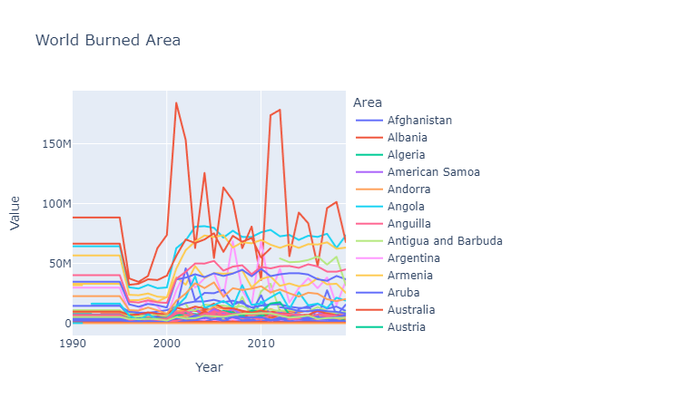

# **Team Entrepreneur**

---

# **Exploratory Data Analysis on Fire Dataset**

## About the Dataset

- Data is taken from [Fao website](https://www.fao.org/faostat/en/#data/GI). All countries available were selected and Year: 1990 to 2019.

## Steps performed

## 1. Import Libraries

- Import necessary libraries

```python
import pandas as pd
import numpy as np
import matplotlib.pyplot as plt
import seaborn as sns
import plotly.express as px
```

## 2. Import dataset

- Import dataset and check dataset

```python
df= pd.read_csv('fires_data_11-29-2021.csv')
df.head()
```

## 3. Shape of dataset

- Check Shape of data

```python
row, cols= df.shape
print("Number of rows:", row)
print("Number of columns:", cols)
```
Dataset has 47649 rows and 17 columns

## 4. Check data types

- Check data types of each column

```python
df.dtypes
```

## 5. Check missing values

- Check missing values in each column

```python
df.isnull().sum()
```

- Only one column (Note) has missing values

## 6. Dropping unnecessary columns

- Drop unnecessary columns and making changes in the dataset

```python
df.drop(['Note','Domain Code','Element Code','Item Code','Flag Description','Flag','Source Code'], axis=1, inplace=True)
```

## 7. Data Structure of dataset

- Check data structure of dataset

```python
df.info()
```

- Data has RangeIndex: 47649 entries, starting from 0 to 47648

- Data has total 10 columns

- dtypes of columns are one float64, two int64 and seven object

- Memory usage of the data is 3.6 MB

## 8. Summery of dataset

- Summery of dataset

```python
df.describe()
```

## 9. Unique values in each column

- Unique values in each column

```python
df.nunique()
```

- 238 Countries
- 30 Years
- 7 Items

## 10. Value counts

- Value counts of Item column

```python
df['Item'].value_counts()
```

Seven different items are available in the dataset and their count are:

>Humid tropical forest    6807
>
>Other forest             6807
>
>Closed shrubland         6807
>
>Grassland                6807
>
>Open shrubland           6807
>
>Savanna                  6807
>
>Woody savanna            6807

# **Insights of Datasets**

## 1. Land affected by fires yearly

```python
s=df.groupby(["Year"]).sum().sort_values(by="Value", ascending=False).head(30)
s
```

|Year  | Value
|:-------|-----:|
| 2012 | 8.320688e+08|
|2007	| 8.303040e+08|
|2011	| 8.294422e+08|
|2002	| 8.285003e+08|
|2004	| 8.227932e+08|
|2005	| 7.998101e+08|
|2003	| 7.846035e+08|
|2006	| 7.715579e+08|
|2010	| 7.536716e+08|
|2008	|	7.461368e+08|
|2001	|	7.394390e+08|
|2017	|	7.011378e+08|
|2015	|	6.869739e+08|
|2014	|	6.793501e+08|
|2009	|	6.761442e+08|
|1995	|	6.640982e+08|
|1994	|	6.640982e+08|
|1993	|	6.640982e+08|
|1992	|	6.640982e+08|
|1990	|	6.640982e+08|
|1991	|	6.640982e+08|
|2016	|	6.469105e+08|
|2013	|	6.379084e+08|
|2018	|	6.311982e+08|
|2019	|	6.064821e+08|
|1998| 3.534771e+08|
|2000|	3.421322e+08|
|1999|	3.396431e+08|
|1996|	3.087709e+08|
|1997|	3.022354e+08|

- The highest value is in year **2012** value of **8.320688e+08**
- The lowest value is in year **1997** value of **3.022354e+08**


### Graphical Representation land affected by fires yearly

```python
plt.figure(figsize=(5,3), dpi=150, linewidth=2)
sns.barplot(x=s.index,y='Value',data=s, palette="winter")
plt.xticks(rotation=90)
plt.title('Land affected by fires yearly')
```


## 2. Top 10 countries affected by fires

```python

```python
a=df.groupby(["Area"]).sum().sort_values(by="Value", ascending=False).head(30)
a
```

|Area  | Value|
|:-------|-----:|
|Australia	|2.650662e+09|
|Angola	|	1.927834e+09|
|Democratic Republic of the Congo|	1.698499e+09|
|Sudan (former)	|	1.304401e+09|
|Zambia	|	1.204405e+09|
|Mozambique	|	1.040799e+09|
|Central African Republic|	9.843985e+08|
|Brazil	|	8.904736e+08|
|United Republic of Tanzania	|	6.783696e+08|
|Russian Federation	|	4.573399e+08|

- Australia has the highest value of **2.650662e+09**

### Graphical Representation of top 10 countries affected by fires

```python
plt.figure(figsize=(5,3), dpi=150, linewidth=2)
sns.barplot(x=a.index,y='Value',data=a)
plt.xticks(rotation=90)
plt.title('Top 10 Countries affected by fires')
```


## 3.Item type burned by fire over years

- Item type burned by fire over years

```python
b=df.groupby(["Item"]).sum().sort_values(by="Value", ascending=False)
b
```
|Item  | Value|
|:-------|-----:|
|Savanna	|	7.831523e+09|
|Grassland	|	6.801505e+09|
|Woody savanna	|	1.957280e+09|
|Open shrubland	|	1.365417e+09|
|Humid tropical forest	|	1.132681e+09|
|Other forest	|	4.478974e+08|
|Closed shrubland	|	9.897531e+07 |

- Savanna is most burned item type with value of **1.957280e+09**

- Closed shrubland is least burned item type with value of **9.897531e+07**


### Graphical Representation of item type affected by fire

```python
plt.figure(figsize=(5,3), dpi=150)
sns.barplot(x=b.index,y='Value',data=b)
plt.xticks(rotation=90)
plt.title("Item type affected by fires")
```


## 4. Maximum area burned in a year in a country

- Maximum area burned in a year in a country

```python
df.groupby(["Year","Area"]).sum().sort_values(by="Value", ascending=False).head(10)
```
|Year |Area  | Value|
|:-------|------|-----:|
2001|	Australia	|	1.840483e+08|
2012|	Australia	|	1.783090e+08|
2011|	Australia	|	1.737702e+08|
2002|	Australia	|	1.530490e+08|
2004|	Australia	|	1.255536e+08|
2006|	Australia	|	1.134671e+08|
2007|	Australia	|	1.025287e+08|
2018|	Australia	|	1.013396e+08|
2017|	Australia	|	9.615384e+07|
2014|	Australia	|   9.246523e+07|

- For most Forest and Savanna burned in a year in a country Australia has 10 top values of the burned area in a country in a year.

### Graphical Representation of maximum area burned in a year in a country

--  Groupby Area, Area code and year and sum the values and rest index will give sum of all the tyoes of forest burned in a year in a country

```python
df1 = df.groupby(["Area", "Area Code (ISO3)", "Year"])["Value"].sum().reset_index()
df1.head()
```

- Ploting the graph

```python
plt.figure(figsize=(15,3), dpi=150)
fig = px.line(df1, x="Year", y="Value",color='Area', title='World Burned Area')
fig.show()
```



## 5. Item type burned most in a year

- Item type burned most in a year

```python
df.groupby(["Year","Item"]).sum().sort_values(by="Value", ascending=False).head(10)
```
|Year |Item  | Value|
|:-------|------|-----:|
2005|	Savanna	|	3.487667e+08
2003|	Savanna	|	3.414789e+08
2007|	Savanna	|	3.294614e+08
2004|	Grassland	|	3.285651e+08
2002|	Grassland	|	3.209670e+08
2007|	Grassland	|	3.209456e+08
2008|	Savanna	|	3.151744e+08
2010|	Savanna	|	3.136204e+08
2004|	Savanna	|	3.135659e+08
2005|	Grassland	|	3.107788e+08


- For most Forest and Savanna burned in a year Savanna has the highest value of **3.487667e+08** in year **2005**

## 6. Which type of item is burned most in a year and in which country

```python
df.groupby(["Year","Area","Item"]).sum().sort_values(by="Value", ascending=False).head(10)
```

|Year |Area  | Item | Value|
|:-------|------|-----:|-----:|
2011|	Australia	|Open shrubland	|	1.052085e+08
2012|	Australia	|Open shrubland	|	9.431891e+07
2001|	Australia	|Open shrubland	|	9.156779e+07
2002|	Australia	|Open shrubland	|	8.998342e+07
2001|	Australia	|Grassland	|	7.639979e+07
2004|	Australia	|Grassland	|	6.797964e+07
2012|	Australia	|Grassland	|	6.456851e+07
2011|	Australia	|Grassland	|	5.287709e+07
2017|	Australia	|Open shrubland	|	5.209256e+07
2006|	Australia	|Grassland	|	5.006097e+07

- For most Forest and Savanna burned in a year in a country Open shrubland has the highest value of **1.052085e+08** in year **2011** in Australia

- Open shrubland and Grassland are most burned item type in a year in a country.

- Both item type are most burned Australia in a year.

# **Selected countries Analysis**

## 1.Select countries

- Select sub-continent countries

```python
df_selected = df[df["Area"].isin(["India", "Pakistan","Bangladesh"])]
```

- India, Pakistan and Bangladesh are the selected countries in south Asia

| Area | Value|
|:-------|------:|
India	|	6.546250e+07
Bangladesh	| 2.536032e+06
Pakistan	|	1.015368e+06


- From the above analysis we can say that **India** is the most affected country in subcontinent with value of **6.546250e+07**

- **Pakistan** is least affected country in subcontinent with value of **1.015368e+06**

## 2. Item type burned by fire in selected countries

- Item type burned by fire in selected countries

```python
df_selected.groupby(["Item"]).sum().sort_values(by="Value", ascending=False).head(10)
```

|Item  | Value|
|:-------|-----:|
Other forest	|	2.952491e+07
Woody savanna	|	1.180380e+07
Humid tropical forest	|	1.146947e+07
Grassland	|	8.249579e+06
Savanna	|	7.762407e+06	
Open shrubland	|	1.553655e+05
Closed shrubland	|	5.010989e+04

- From the subcontinent countries, the most burned item type was **Other forest** with value of **2.952522e+07**

- Least burned item type is **Closed shrubland** with value of **5.624728e+04**

## 3. Most burned area in selected countries in a year

- Most burned area in selected countries in a year

```python
df_selected.groupby("Year").sum().sort_values(by="Value", ascending=False)
```

|Year |Value|
|:-------|-----:|
2009	|	5.705159e+06
2012	|	5.201674e+06
2010	|	4.037667e+06
2017	|	3.677225e+06
2018	|	3.413118e+06
2004	|	3.239376e+06
2007	|	2.952916e+06
2013	|	2.908165e+06
2014	|	2.762922e+06
2016	|	2.710776e+06
2011	|	2.484390e+06
2008	|	2.388524e+06
1995	|	2.302982e+06
1994	|	2.302982e+06
1993	|	2.302982e+06
1991	|	2.302982e+06
1992	|	2.302982e+06
1990	|	2.302982e+06
2006	|	2.230222e+06
2003	|	1.952966e+06
2019	|	1.895419e+06
2015	|	1.893740e+06
2005	|	1.841006e+06
2001	|	1.098290e+06
2002	|	6.435178e+05
1999	|	5.964729e+05
1998	|	4.256860e+05
1996	|	4.232155e+05
2000	|	3.992597e+05
1997	|	3.143008e+05

- From the above table it is clear the most area burned in a year is in year **2009** with value of **5.705159e+06**

- Minimum area burned in a year is in year **1997** with value of **3.143008e+05**

## 4. Graphical analysis of selected countries

- Graphical analysis of selected countries

```python
plt.figure(figsize=(15,8), dpi=150)
sns.set(font_scale=1)
sns.set_style("whitegrid")
sns.lineplot(x="Year",y="Value",hue="Area",style="Item",data=df_selected)
plt.title("Fires by year and area")
```


- Above graph is visualized to show the fires by year and area of selected countries with the style of line for the item type.

## 5.Graph of subcontinent countries showing yearly fire area

- Graph of subcontinent countries showing yearly fire area

```python
fig = px.line(df2, x="Year", y="Value",color='Area', title='Subcontinent Burned Area')
fig.show()
```


# **Conclusion**

- ## 1. For World

    - The highest value of land burned was in year **2012** which **8.320688e+08**
    - The lowest value of land burned was in year **1997** which is **3.022354e+08**
    - **Australia** is most affected country with area affected was **2.650662e+09**
    - **Savanna** is most burned item type with value of **1.957280e+09**
    - **Closed shrubland** is least burned item type with value of **9.897531e+07**
    - For most Forest and Savanna burned in a year in a country **Australia** has 10 top values of the burned area in a country in a year.
    - For most Forest and Savanna burned in a year **Savanna** has the highest value which is **3.487667e+08** in year **2005**
    - For most Forest and Savanna burned in a year in a country **Open shrubland** has the highest value which is **1.052085e+08** in year **2011** in **Australia**
    - **Open shrubland** and **Savanna** are in top 10  item type most burned in **Australia** in a year.


- ## 2. Subcontinent countries Analysis

    - **India** is the most affected country from Subcontinent with value of **6.546250e+07**
    - **Pakistan** is least affected country from Sub continent with value of **1.015368e+06**
    - From the subcontinent countries, the most burned item type was **Other forest** with value of **2.952522e+07**
    - Least burned item type is **Closed shrubland** with value of **5.624728e+04**
    - Most area burned in a year in subcontinent was in year **2009** having value **5.705159e+06**
    - Minimum area burned in a year in subcontinent was in year **1997** having value **3.143008e+05**